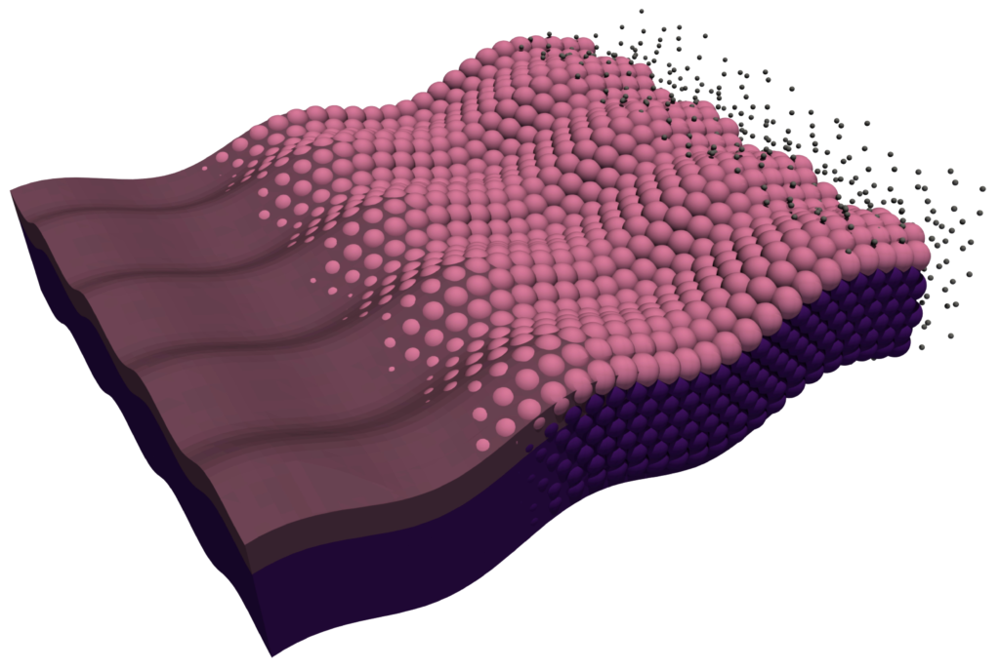
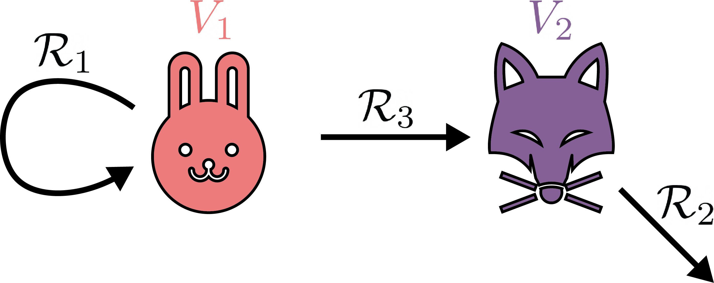
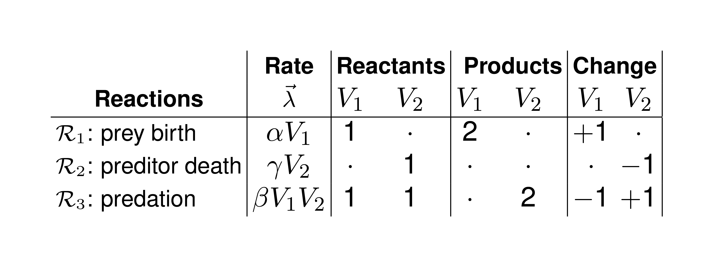
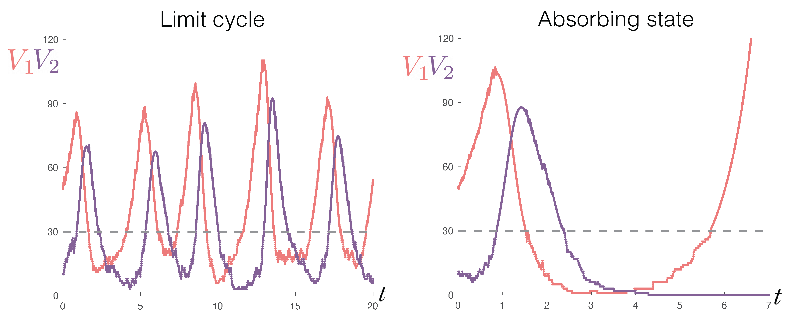
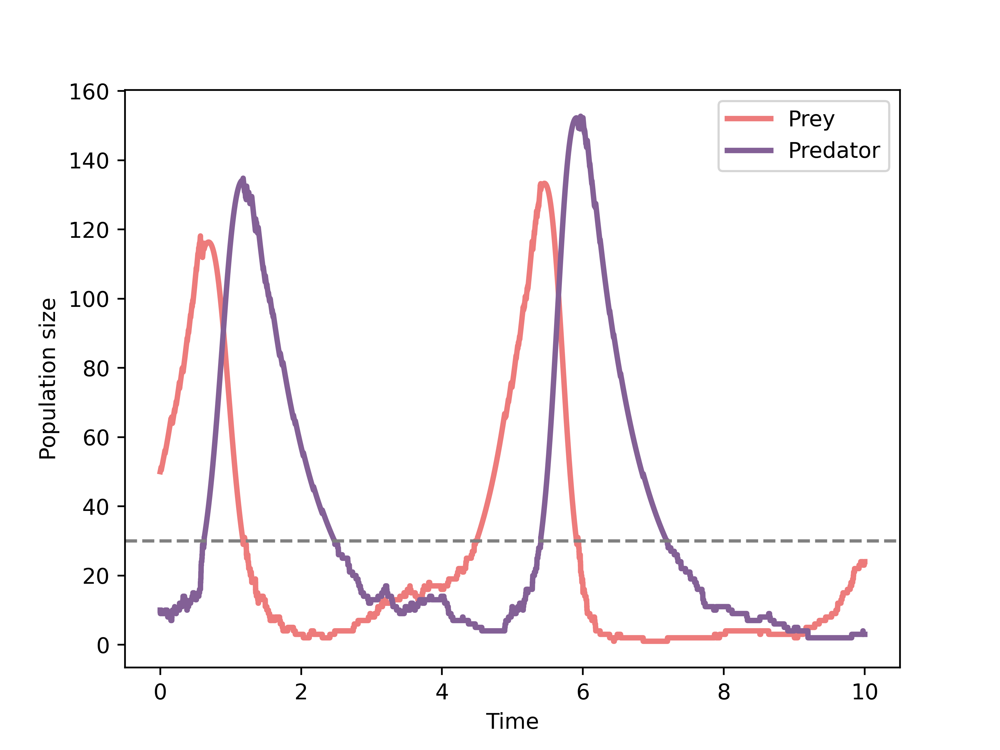

.. Jump-Switch-Flow documentation master file, created by
   sphinx-quickstart on Tue Dec  5 12:01:50 2023.
   You can adapt this file completely to your liking, but it should at least
   contain the root `toctree` directive.

Jump-Switch-Flow Documentation
==============================================

.. contents::
   :local:
   :depth: 1

Overview
--------

This package provides an algorithm for sampling from the
Jump-Switch-Flow (JSF) process. The JSF process is a continuous-time
process that can be used to represent compartmental models where
stochastic effects are important at low population sizes but can be
ignored at high population sizes.

Here, we provide a brief overview of the JSF process and how it can be used to simulate
compartmental models through a Lotka-Volterra predator-prey model example. The Mathematical
framework of the JSF process is also discussed.

Interactive Jupyter Notebook Playground
^^^^^^^^^^^^^^^^^^^^^^^^^^^^^^^^^^^^^^^
An interactive BETA version of the below example is also available `here <https://dgermano8.github.io/JSFOnlineDemo>`_ (best viewed in Firefox or Chrome).

Lotka-Volterra predator-prey model example
------------------------------------------

As a simple example for how JSF can be used to capture both stochastic and deterministic
dynamics, we consider the classic Lotka-Volterra preditor-prey model. 
In this model, individuals are either prey (:math:`V_1`) or predator (:math:`V_2`).
This model is famous for being susceptible to Atto-fox problem, where the deterministic description
of the model allows for states to become infeasibly small, where the compartment would have otherwise had gone 
extinct. However, we will see that the JSF process can capture the stochastic effects of the model and permit 
the system to exhibit both the typical coexistence of the two species and the extinction of one of the species.

The model is described as the following way: the prey reproduce at a constant rate and are eaten by predator at a rate proportional
to the number of predator. The predator die at a constant rate and are reproduced at 
a rate proportional to the number of prey they eat. Mathematically, the model is given by:

.. math::
   \frac{\mathrm{d} V_1}{\mathrm{d} t} &= \alpha V_1 - \beta V_1 V_2,\\
   \frac{\mathrm{d} V_2}{\mathrm{d} t} &=  \beta V_1 V_2 - \gamma V_2.

The compartment model diagram for this preditor-prey model is shown below.

Written as a JSF model, the stoichiometric matrices for the predator-prey model is given by:

We can simulate this model using the JSF process. In doing so, we can see how the model behaves
as both a stochastic and deterministic process to obtain both the limit cycle and absorbing state behaviour, 
as shown in the figure below.

Implementing the Predator-prey model with JSF
^^^^^^^^^^^^^^^^^^^^^^^^^^^^^^^^^^^^^^^^^^^^^

To simulate the Lotka-Volterra predator-prey model using the JSF process, we first need to import the necessary packages.

.. code-block:: python

   import pandas as pd
   import random
   import matplotlib.pyplot as plt
   import jsf

   random.seed(42)

Here, ``pandas`` is used to store the simulation results, ``random`` is used to set the seed for reproducibility, 
``matplotlib`` is used to plot the results, and ``jsf`` is the package we are using to simulate the process.

Next, we define the initial condition of the predator-prey model and the
model parameters. The predator-prey model has two compartments, so we define the
initial condition as a list of length two:

.. code-block:: python

   x0 = [50, 10]

This initalises the model with 50 prey and 10 predators.

Next, the model parameters are the reproduction rate of the prey, ``mA``, the predation rate, ``mB``, 
the death rate of the predators, ``mC``:

.. code-block:: python

   mA = 2.00
   mB = 0.05
   mC = 1.50

We then define the rates of the model:

.. code-block:: python

   rates = lambda x, _: [mA * x[0],
                         mC * x[1],
                         mB * x[0] * x[1]]

and the stoichiometric matrices of the model:

.. code-block:: python

   reactant_matrix = [[1 , 0],
                      [0 , 1],
                      [1 , 1]]

   product_matrix = [[2 , 0],
                     [0 , 0],
                     [0 , 2]]

We define the maximum time of the simulation:

.. code-block:: python

   t_max = 10

There is a little bit of configuration needed to tell JSF how to 
actually run the simulation. Namely, we use the stoichiometric matrices to define the stoichiometry
of the process. ``DoDisc`` is a boolean list, and describes which compartments are initially represented 
as a stochastic processes.

.. code-block:: python

   stoich = {
            "nu": [ [a - b for a, b in zip(r1, r2)] 
                   for r1, r2 in zip(product_matrix, reactant_matrix) ],
            "DoDisc": [1, 1],
            "nuReactant": reactant_matrix,
            "nuProduct": product_matrix,
            }

Now all we need to set are the options for the simulation. We set the time step, ``dt`` to be 0.01 and the 
threshold for switching, ``SwitchingThreshold``,  to be 30 for both compartments. ``EnforceDo`` is a boolean list and describes which
compartments are permitted to dynamically change between discrete and continuous regimes. If an entry of ``EnforceDo`` is 0, 
then that compartment is allowed to switch between discrete and continuous regimes. If an entry of ``EnforceDo`` is 1, then that
compartment is not allowed to switch, and will remain in the regime it was initialised in.

.. code-block:: python

   my_opts = {
               "EnforceDo": [0, 0], 
               "dt": 0.01,
               "SwitchingThreshold": [30, 30]
              }

We are now able to call `jsf.jsf` to simulate the process using the "operator splitting" method.

.. code-block:: python

   sim = jsf.jsf(x0, rates, stoich, t_max, config=my_opts, method="operator-splitting")

Visualising the simulation
^^^^^^^^^^^^^^^^^^^^^^^^^^

Finally, we can plot the results of the simulation. We'll use a combination of `pandas` and `matplotlib` to do this,
but the output of `jsf` is a pandas DataFrame of numbers so it's easy to use whichever plotting library you prefer.

.. code-block:: python

   plt.plot(sim[1], sim[0][0], label="Prey")
   plt.plot(sim[1], sim[0][1], label="Predator")
   plt.axhline(y=my_opts["SwitchingThreshold"][1], color="k", linestyle="--")
   plt.xlabel("Time")
   plt.ylabel("Population size")
   plt.legend()
   plt.savefig('PredatorPrey.png', dpi=500)
   plt.show()

Installation
------------

.. _installation:

This package is not yet available on PyPI. You can install it from a :ref:`local copy <local_copy_installation>` or from :ref:`GitHub <github_installation>`.

.. _local_copy_installation:

From Local Copy
^^^^^^^^^^^^^^^

If you have a local copy of the package, you can install it with pip.

.. code-block:: sh

   pip install /path/to/package

.. _github_installation:

From GitHub
^^^^^^^^^^^

You can install JSF with pip from GitHub, at https://github.com/DGermano8/jsf:

.. code-block:: sh

   pip install git+https://github.com/DGermano8/jsf.git

Types
-----

The ``jsf.types`` module provides some key types for this package.
There is nothing fancy here; they are just used to make the type hints
more informative and help to leverage ``mypy``.

- ``CompartmentValue``: the value of a compartment, this is a ``float``.
- ``SystemState``: the state of the system, this is a list of ``CompartmentValue`` s.
- ``Time``: the time, this is a float.

Recall you can use the following to type check the code:

.. code-block:: sh

    mypy jsf tests

API
---

.. toctree::
   :maxdepth: 2
   :caption: Modules

   jsf_mathematical_framework
   jsf
   exact

FAQs
----

If you have a question that is not answered by this documentation,
please lodge an issue on the GitHub page for this package:
https://github.com/DGermano8/jsf

Housekeeping
------------

Testing
^^^^^^^

There are some unit tests in the ``tests`` directory. You can run them
with the following command.

.. code-block:: sh

   python3 -m unittest discover -s tests

Code formating and checking
^^^^^^^^^^^^^^^^^^^^^^^^^^^

This package uses ``black`` and ``mypy`` for code formatting and type
checking, respectively. You can run them with the following commands.

.. code-block:: sh

   black jsf
   mypy jsf
