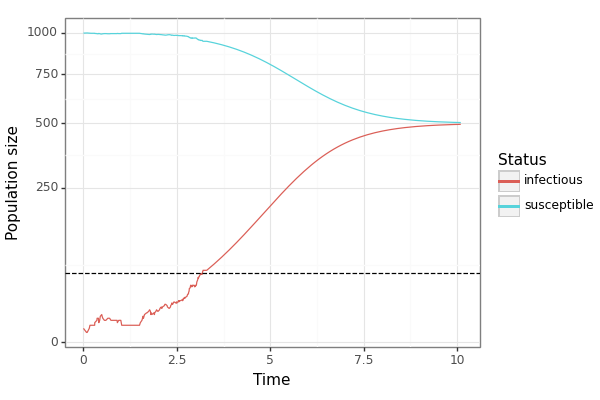

.. Jump-Switch-Flow documentation master file, created by
   sphinx-quickstart on Tue Dec  5 12:01:50 2023.
   You can adapt this file completely to your liking, but it should at least
   contain the root `toctree` directive.

Welcome to the Jump-Switch-Flow Documentation!
==============================================

.. image:: _static/jsf-logo.png
   :width: 400
   :align: center

.. contents::
   :local:
   :depth: 2

Overview
--------

This package provides an algorithm for sampling from the
Jump-Switch-Flow (JSF) process. The JSF process is a continuous-time
process that can be used so represent compartmental models where
stochastic effects are important at low population sizes but can be
ignored at high population sizes.

Epidemic simulation example
---------------------------

As a simple example, consider the SIS epidemic model. In this model,
individuals are either susceptible (S) or infected (I). Susceptible
individuals become infected at a rate proportional to the number of
infected individuals, and infected individuals recover at a constant
rate.

We can simulate this model using the JSF process. The only package
that is needed is `jsf`, but we will import a few others to help us
visualise the results.

.. code-block:: python

   import pandas as pd
   from plotnine import *
   import random
   import jsf
   random.seed(7)

Defining the SIS model
^^^^^^^^^^^^^^^^^^^^^^

Next, we define the initial condition of the SIS model and the
infection and recovery process. The SIS model has two compartments,
so we define the initial condition as a list of length two. The
infection and recovery process is defined by a function that takes
the current state of the system and the current time and returns a
list of length two containing the rates of infection and recovery.

The reactant and product matrices are used to define the stoichiometry
of the process. The reactant matrix defines the change in the number
of individuals in each compartment when a reaction occurs, and the
product matrix defines the change in the number of individuals in each
compartment after a reaction occurs. For the SIS model, the reactant
matrix is ``[[1, 1], [0, 1]]`` and the product matrix is
``[[0, 2], [1, 0]]``. This means that when an infection occurs, the
number of susceptible individuals decreases by one and the number of
infected individuals increases by one. When a recovery occurs, the
number of infected individuals decreases by one and the number of
susceptible individuals increases by one.

.. code-block:: python

   x0 = [1000 - 2, 2]
   rates = lambda x, _: [2e-3 * x[0] * x[1], 1.0 * x[1]]
   reactant_matrix = [[1, 1], [0, 1]]
   product_matrix = [[0, 2], [1, 0]]

Finally, we define the maximum time of the simulation.

.. code-block:: python

   t_max = 10.0

There is a little bit of configuration needed to tell JSF how to
actually run the simulation.

.. code-block:: python

   stoich = {
       "nu": [
           [a - b for a, b in zip(r1, r2)]
           for r1, r2 in zip(product_matrix, reactant_matrix)
       ],
       "DoDisc": [1, 1],
       "nuReactant": reactant_matrix,
       "nuProduct": product_matrix,
   }
   my_opts = {"EnforceDo": [0, 0], "dt": 0.1, "SwitchingThreshold": [50, 50]}

Then we can call `jsf.JumpSwitchFlowSimulator` to simulate the process

.. code-block:: python

   sim = jsf.JumpSwitchFlowSimulator(x0, rates, stoich, t_max, my_opts)

Visualising the simulation
^^^^^^^^^^^^^^^^^^^^^^^^^^

Finally, we can plot the results of the simulation. We'll use a
combination of `pandas` and `plotnine` to do this, but the output of
`jsf` is a list of numbers so it should be easy to use whichever
plotting library you prefer.

.. code-block:: python

   sim_df = pd.DataFrame(
       {"time": sim[1], "susceptible": sim[0][0], "infectious": sim[0][1]}
   ).melt(id_vars=["time"], value_vars=["susceptible", "infectious"])

   sim_p9 = (
       ggplot()
       + geom_line(data=sim_df, mapping=aes(x="time", y="value", colour="variable"))
       + geom_hline(yintercept=my_opts["SwitchingThreshold"][1], linetype="dashed")
       + scale_y_sqrt(name="Population size")
       + labs(x="Time", colour="Status")
       + theme(legend_position="top")
       + theme_bw()
   )

   sim_p9.save("sis_example.png", height=4, width=6)

Which gives us the following plot. Note that initially the process is
stochastic as it jumps around before hitting the threshold at which
point it follows the differential equations.

Installation
------------

.. _installation:

This package is not yet available on PyPI. You can install it from a :ref:`local copy <local_copy_installation>` or from :ref:`GitHub <github_installation>`.

.. _local_copy_installation:

From Local Copy
^^^^^^^^^^^^^^^

If you have a local copy of the package, you can install it with pip.

.. code-block:: sh

   pip install /path/to/package

.. _github_installation:

From GitHub
^^^^^^^^^^^

This won't work until the package has been made public. Once it has,
you can install it with pip.

.. code-block:: sh

   pip install git+https://github.com/DGermano8/jsf.git

FAQs
----

If you have a question that is not answered by this documentation,
please lodge an issue on the GitHub page for this package:
https://github.com/DGermano8/jsf

Housekeeping
------------

Testing
^^^^^^^

There are some unit tests in the ``tests`` directory. You can run them
with the following command.

.. code-block:: sh

   python3 -m unittest discover -s tests

Code formating and checking
^^^^^^^^^^^^^^^^^^^^^^^^^^^

This package uses ``black`` and ``mypy`` for code formatting and type
checking, respectively. You can run them with the following commands.

.. code-block:: sh

   black jsf
   mypy jsf

Building the documentation
^^^^^^^^^^^^^^^^^^^^^^^^^^

.. code-block:: sh

   make html
   cp build/html <my/website>

..  LocalWords:  JSF
