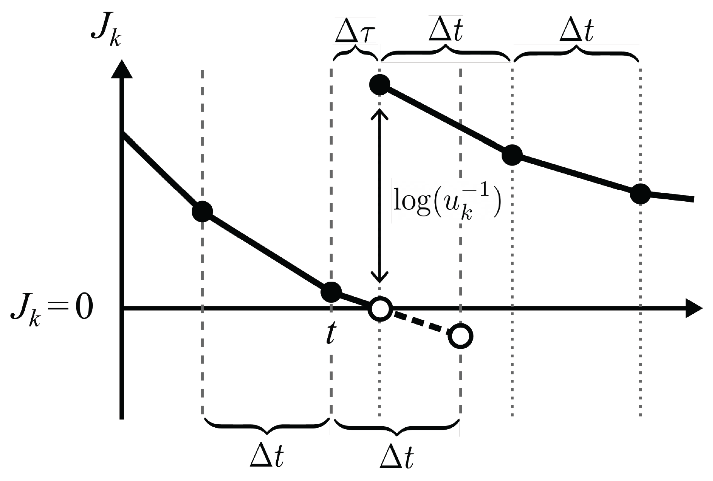

JSF Mathematical Framework
--------------------------

To couple both the stochastic (Jumping) and deterministic (Flowing)
compartments, we model each compartment as to where they are in state space.

Consider a compartmental model with :math:`n` compartments :math:`\vec{V} = \left\{ V_i\right\}_{i=1}^n`, 
where :math:`V_{i}(t)` represents the value of the :math:`i` th compartment at time :math:`t`. 
For example, :math:`V_i` could be the number of people infected with a pathogen, or the copy 
number of a molecule in a cell. The state variables :math:`V_i` may take values from different 
domains depending upon the resolution needed for the model. For example, in an ODE, :math:`\vec{V}` 
will have real values and in a CTMC :math:`\vec{V}`  might have integer values.

Typically, discrete values are used to represent small populations, while larger populations 
will be represented with a continuum. To accommodate both scales, we model the domain of :math:`V_{i}`
as :math:`\mathcal{V}_{\Omega_i}=\{0,1,\ldots,\Omega_{i}\}\cup(\Omega_{i},\infty)`. The switching 
threshold parameter, :math:`\Omega_i\in \mathbb{Z}_{\geq 0}`, is where the :math:`i` th compartment 
transitions from discrete to continuous dynamics. If a compartment :math:`V_{i}` has a value in 
:math:`\{0,1,\ldots,\Omega_{i}\}`, we call it "discrete" (or "jumping"), and if it has a value in 
:math:`(\Omega_{i},\infty)`, we call it "continuous" (or "flowing"). While the switching threshold 
can be compartment specific, for ease of exposition, we will only consider a single threshold shared 
between all compartments :math:`\Omega = \Omega_i`. At any moment in time let us assume :math:`q` of the 
:math:`n` compartments are flowing. We use the notation :math:`\vec{V}_F = \left\{ V_i: V_i>\Omega \right\} \in (\Omega,\infty)^q`
and :math:`\vec{V}_J = \left\{ V_i: V_i\leq \Omega \right\} \in \left\{0, 1, \ldots, \Omega \right\}^{(n-q)}` 
to represent the compartments in each of the flowing and jumping states, respectively. 

The dynamics of each compartment :math:`V_i` are described by a set of :math:`m` "reactions" 
:math:`\mathcal{R} = \left\{\mathcal{R}_k \right\}_{k=1}^m`. Each reaction :math:`\mathcal{R}_k`
is defined by two properties: the rate (per unit time) at which it occurs, :math:`\lambda_{k}`, which may be 
(and usually is) a function of the state :math:`\vec{V}`; and the effect on the state, i.e. the change :math:`\eta_{ik}` 
to the size of compartment :math:`V_i` when reaction :math:`\mathcal{R}_k` occurs. As a matrix, 
:math:`\eta\in \mathbb{Z}^{n,m}` is referred to as the "stoichiometric matrix". For ODE models, these 
reactions occur continuously and are written in the form

.. math::
  \frac{\mathrm{d}\vec{V}}{\mathrm{d}t} = \eta \vec{\lambda}(\vec{V}),

while for CTMC models, reactions in the system :math:`\mathcal{R}` occur as discrete events.
In the later case, each reaction :math:`\mathcal{R}_k` has a separate propensity described by 
:math:`\lambda_k(\vec{V})`, this propensity remains constant between events but when an event 
:math:`\mathcal{R}_k` occurs, there is a change in :math:`\vec{V}` (as specified by the elements of 
:math:`\eta_{\cdot k}`) and therefore in :math:`\vec{\lambda}(\vec{V})`.

We define the subset of reactions :math:`\mathcal{S}\subseteq \mathcal{R}` to contain those treated 
as stochastic events. We define :math:`\mathcal{S}`, which we use throughout this manuscript, captures 
a larger set of reactions; :math:`\mathcal{S} = \left\{\mathcal{R}_k:\exists i \text{ s.t. } V_i\in\vec{V}_J \text{ and }  \left(\eta_{ik}\neq 0 \text{ or } \partial_{V_i}\lambda_k \neq 0\right)   \right\}`.
In this definition, a reaction is included in :math:`\mathcal{S}` if either (1) it causes a change in 
jumping (discrete) populations \textit{or} (2) it is influenced by a discrete population (perhaps as reactants for example). 

Reactions in :math:`\mathcal{S}` are simulated using stochastically sampled times similar to CTMC models. 
It is important to note that, unlike time homogeneous CTMC models, the propensities are not constant 
because the state :math:`\vec{V}` (and therefore :math:`\vec{\lambda}`) are continuously varying.
When any reaction :math:`\mathcal{R}_k\in\mathcal{S}` occurs, we say the system has "jumped" and an 
instantaneous change of :math:`\eta_{ik}` for each compartment :math:`V_i` occurs (irrespective of whether
:math:`V_i\in\vec{V}_J` or :math:`V_i\in\vec{V}_F` to ensure mass conservation is observed). We will refer 
therefore to reactions in :math:`\mathcal{S}` as "jumps". The reactions in :math:`\mathcal{S}'=\mathcal{R}\setminus \mathcal{S}`
are not stochastic, we call these "flows" because they represent the continual change of value of the 
relevant compartments, all of which are continuous by definition of :math:`\mathcal{S}'`.
At any moment in time, we denote :math:`|\mathcal{S}'| = p = m - |\mathcal{S}|` to be the number of reactions
which are flowing.

Finally, the hybrid model that we propose is capable of "switching". Switch events are defined as a 
compartment between :math:`\vec{V}_F` and :math:`\vec{V}_J`. These events occur when a compartment's 
value crosses the switching threshold :math:`\Omega`. Importantly, switch events can change 
:math:`\mathcal{S}` and are paradigm defining events which should occur infrequently compared to
jumps (frequent) and flows (continuous).

Due to the way that :math:`\mathcal{R}` is partitioned, it is possible to order the rows and columns of :math:`\eta` at 
any moment into the upper-triangular block form

.. math::
   \eta = \left(\begin{array}{c|c}
   \eta_{\mathcal{S}'} & \bar{\eta}_{\mathcal{S}} \\ \hline
   0 & \eta_{\mathcal{S}} \end{array}\right),

where :math:`\eta_{\mathcal{S}'} \in \mathbb{Z}^{q\times p}`, :math:`\eta_{\mathcal{S}} \in \mathbb{Z}^{(n-q)\times (m-p)}`
and :math:`\bar{\eta}_{\mathcal{S}} \in \mathbb{Z}^{q\times (m-p)}` refer to stoichiometric coefficients for changes in flowing 
compartments under flows, jumping compartments under jumps, and flowing compartments under jumps, respectively. Written 
as a system of equations analogous to the above ODE equation, the hybrid JSF model we propose formally takes the following form. 
For any time interval :math:`t_0<t<t_1` between switching events, 

.. math::
    \frac{\mathrm{d} \vec{V}_F}{\mathrm{d} t} &= \eta_{\mathcal{S}'} \vec{\lambda}_{\mathcal{S}'}(\vec{V}) + \bar{\eta}_{\mathcal{S}} \vec{\Lambda}_{\mathcal{S}}(\vec{V}),\\
    \vec{V}_J(t) &= \vec{V}_J(t_0) + \eta_{\mathcal{S}} \int_{t_0}^t  \vec{\Lambda}_{\mathcal{S}}(\vec{V}) \ \mathrm{d} s,

where :math:`\vec{\lambda}_{\mathcal{S}'}\in\mathbb{R}^p` are the reaction rates of flows and :math:`\vec{\Lambda}_{\mathcal{S}}`
is a stochastic vector of :math:`m-p` delta-function spike trains that are derived from the realisations of :math:`m-p` 
different jumps sampled at rates which are dependent on the dynamic changes in the propensities :math:`\vec{\lambda}_{\mathcal{S}}\in\mathbb{R}^{m-p}` for these jumps.

The below figure shows how it is
possible for a variable to `switch` between flowing and jumping
regimes for the previously described Lotka-Volterra model. When a flowing variable decreases to :math:`\Omega`, it switches
to jumping and we consider it a discrete variable. When a jumping
variable jumps from :math:`\Omega` to :math:`\Omega+1` it switches to flowing
and we consider it to be a continuous variable.

.. image:: _static/compartment_switching_depiction.png
   :width: 500
   :align: center
   :alt: compartment_switching_depiction

For :math:`t< t_1`, :math:`V_2` is jumping, and :math:`V_1` is flowing. Since :math:`V_2` is jumping, 
the conversion of :math:`V_1` into :math:`V_2` (:math:`\mathcal{R}_3`) is a jump, and as a result 
jump increases in :math:`V_2` due to :math:`\mathcal{R}_3` correspond to jump decreases in :math:`V_1`. 
On the other hand, the only flow in the system is that of :math:`\mathcal{R}_1`, the birth of :math:`V_1`
which can be seen as continuous increases in :math:`V_1` between jumps. We also note that :math:`\mathcal{R}_2`
(the death events of :math:`V_2`) is also jumping. However, for :math:`t < t_1`, we do not observe this 
reaction occurring.
At :math:`t=t_1`, :math:`V_2 > \Omega`, and both :math:`V_1` and :math:`V_2` are flowing. The model 
therefore behaves according to the ODE model with an initial condition prescribed at :math:`t=t_1`. 
At :math:`t=t_2`, :math:`V_1` drops below :math:`\Omega`, and therefore switches to jumping.
The conversion of :math:`V_1` to :math:`V_2` (:math:`\mathcal{R}_3`) again become jumps. In the regime 
following :math:`t=t_2` the only flow is :math:`\mathcal{R}_2` (the death events of :math:`V_2`) and so 
between :math:`\mathcal{R}_3` events, exponential decay of :math:`V_2` is taking place. It is also 
possible to see :math:`\mathcal{R}_1` (births of :math:`V_1`) occur in this regime as independent jump 
increases in :math:`V_1` that do not change :math:`V_2`.
Finally, at :math:`t=t_3`, :math:`V_2` also drops below :math:`\Omega` so therefore also switches to
jumping. In this case, all compartments are jumping and therefore beyond :math:`t_3` the hybrid model reduces to a CTMC.

To implement JSF, we require three event types: jump events, flow events, and switch events, which will be described in the following sections.

Jump Events
-----------

The reactions that are defined in :math:`\mathcal{S}` are stochastic events that produce discontinuous 
jumps in the state vector :math:`\vec{V}`. In the above JSF equation, we denote the jumps using 
the notation :math:`\vec{\Lambda}_{\mathcal{S}}(\vec{V})`. Each element in the vector :math:`\vec{\Lambda}_{\mathcal{S}}`
corresponds to a reaction in :math:`\mathcal{S}`. Consider, for example, :math:`\mathcal{S}_K` the :math:`K` th reaction in 
:math:`\mathcal{S}` and we shall suppose that this reaction corresponds to the :math:`k` th reaction in the full model 
:math:`\mathcal{S}_K = \mathcal{R}_k`. The :math:`K` th element of :math:`\vec{\Lambda}_{\mathcal{S}}` is

.. math::
    \Lambda_{\mathcal{S},K} = \sum_{e} \delta(t-t_{k}^{(e)}),

where :math:`\delta` is the Dirac measure and :math:`t_{k}^{(e)}`` is the :math:`e` th time at which the jump event 
:math:`\mathcal{R}_k` takes place. In this way, the term :math:`\vec{\Lambda}_{\mathcal{S}}` the JSF equation
manifests as discrete jumps in both :math:`\vec{V}_F` and :math:`\vec{V}_J` at the moments of each jump event. 
For the sake of the simulation, the computation of the jump times :math:`t_{k}^{(e)}` for each instance :math:`e` of each 
reaction :math:`\mathcal{R}_k\in \mathcal{S}` is all that is required. The stoichiometric coefficients present in 
the JSF equation then indicate the amplitude of the jumps in each compartment.

The instantaneous propensity for a jump associated with reaction :math:`\mathcal{R}_k` is :math:`\lambda_k(\vec{V})`.
We note that this propensity :math:`\lambda_k(\vec{V})` is likely to change with time even between jumps due to the 
continuous change caused by flows. 

We use a variant of the Next Reaction Method (NRM) to sample jump times. We first note that the propensity 
for a jump is dependent only on the instantaneous state :math:`\vec{V}`, and therefore if at a current time :math:`t_0` 
there has been :math:`e-1` jumps associated with reaction :math:`\mathcal{R}_k`, it has no bearing on the distribution 
of the time :math:`t_k^{(e)}`, and therefore we shall simply denote :math:`t_k^{(e)} = t_k` as the next jump 
time for reaction :math:`\mathcal{R}_k`.
The cumulative probability function from which :math:`t_k` is sampled is dependent on the current time :math:`t_0` and 
the evolution of the state variables in time :math:`\vec{V}(t)`. In particular, 
:math:`\text{CDF}(t;k) = 1 - \exp\left\{- \int_{t_{0}}^{t} \lambda_{k}(\vec{V}(s)) ds \right\}`. 
To sample :math:`t_k`, inverse transform sampling is used. Specifically, we first sample :math:`u_{k}\sim\text{Unif(0,1)}` 
and then solve :math:`\text{CDF}(t_k;k) = u_k` for :math:`t_k`. We define :math:`J_k(t)`` as the "jump clock" for reaction 
:math:`\mathcal{R}_k`, noting that :math:`u_k` and :math:`1-u_k` have the same distribution:

.. math::
   J_k(t_k) := \log(u_{k}^{-1}) - \int_{t_{0}}^{t_k} \lambda_{k}(\vec{V}(s)) \ \mathrm{d}s = 0.

In general, we cannot solve directly for :math:`t_k`. Instead, we solve for it numerically by 
tracking the value of :math:`J_k(t)` as :math:`\vec{V}` evolves through flows, jumps and switches. 
For each reaction :math:`\mathcal{R}_k`, at some initial time (for example :math:`t_k^{(e-1)}`) 
we sample :math:`u_k` and initialise :math:`t_0 = t_k^{(e-1)}`. The initial value of :math:`J_k(t)` 
is therefore equal to the positive number :math:`\log(u_{k}^{-1})`. As time progresses, :math:`J_k(t)` 
decreases according to the above equation since :math:`\lambda_k\geq 0`. Its value 'ticks' down 
to zero over time and when :math:`J_k` reaches :math:`0`, a jump associated with :math:`\mathcal{R}_k`
is triggered (hence the name jump clock). As a jump clock reaches 0 and a jump is triggered, the clock 
is reset by sampling a new random number, :math:`u_k\sim\text{Unif}(0,1)`. To update the jump clock,
we require numerical integration of :math:`\lambda_k(\vec{V}(t))` forward in time. Fortunately, 
we also have piece-wise polynomial approximations for :math:`\vec{V}_F(t)` as a result of our numerical
treatment of the continuous flows combined with piece-wise constant values for :math:`\vec{V}_J(t)` 
which only update once jumps occur. We will discuss further the numerical integration and jump 
clock updates 'Jump clock updates'.

Flow Events
-----------

Between jumps, :math:`\vec{V}_J` remains constant and :math:`\vec{V}_F` evolves continuously according to 
the JSF equation at the start. In particular,

.. math::

    \frac{\mathrm{d} \vec{V}_F}{\mathrm{d} t} = \eta_{\mathcal{S}'} \vec{\lambda}_{\mathcal{S}'}(\vec{V}).

This is a standard dynamical system of ODEs. We shall numerically integrate this forward in time over 
discrete time steps :math:`\Delta t` using a simple Forward Euler method. However, higher order forward 
methods may be substituted. In particular, 

.. math::

        \vec{V}_F(t+\Delta t)= \vec{V}_F(t) + \Delta t \, \Delta \vec{V}_F(t) = \vec{V}_F(t) + \Delta t \, \eta_{\mathcal{S}'} \vec{\lambda}_{\mathcal{S}'}(\vec{V}(t)) ,

noting that :math:`\vec{V}_J(t+\Delta t) = \vec{V}_J(t)`.

Switch Events
-------------

Switching events describe instances where compartment membership of :math:`\vec{V}_J` and :math:`\vec{V}_F` 
can suddenly change as well as reaction membership in :math:`\mathcal{S}` and :math:`\mathcal{S}'`. 
There are two types of switching events. The first involves the transitioning of a compartment from :math:`\vec{V}_J`
to :math:`\vec{V}_F`. This transition is straightforward as a new equation is added to the Flowing equations for 
the state :math:`\vec{V}_F` is initialised at the switching time by continuation and initialisation of the new 
flowing compartment at :math:`\Omega`. 

The second type of switching event involves the transition of a compartment from :math:`\vec{V}_F` to :math:`\vec{V}_J`.
Let :math:`V_i` be the compartment switching from :math:`\vec{V}_F` to :math:`\vec{V}_J` due to a jump event, 
such that :math:`V_i \leq \Omega`. In general, these types of jump events result in :math:`V_i` being non-integer, 
i.e. :math:`V_i \notin \mathcal{V}_{\Omega}`.

To ensure the values of :math:`V_{i}` stay in :math:`\mathcal{V}_{\Omega}` we add another constraint. 
Let :math:`\hat{V}_i` be the value of the flowing compartment :math:`V_i` after jumping down across the 
threshold :math:`\Omega` but before being initialised into :math:`\mathcal{V}_{\Omega}`. 
We apply the following rule to reinitialise :math:`V_i` after the switch. 
We take:

.. math::

  V_i = 
  \begin{cases}
   \lceil \hat{V}_i \rceil \text{ with probability  } \hat{V}_i-\lfloor \hat{V}_i \rfloor\\
    \lfloor \hat{V}_i \rfloor \text{ with probability  } 1- \hat{V}_i+\lfloor \hat{V}_i \rfloor\\
   \end{cases}

This ensures the expected state of the process after the switch is :math:`\hat{V}_i` 
as described under the flowing paradigm from which this compartment has come and that the variable 
remains in the domain :math:`\mathcal{V}_{\Omega}`.

Jump Clock Updates
-------------

For a given jump reaction :math:`\mathcal{R}_k`, a clock is initialised at time :math:`t_0`; 
and :math:`u_k\sim\text{Unif}(0,1)`, giving :math:`J_k = \log(u_k^{-1})`. Over the course of a time step 
from $t$ to :math:`t+\Delta t`, it is observed from before that the clock ticks down from 
:math:`J_k` to :math:`J_k - \Delta J_k` where, since :math:`\Delta t`` is small

.. math::

    \Delta J_k =  \int_{0}^{\Delta t} \lambda_{k}(\vec{V}(t+s)) \ \mathrm{d}s &= \int_{0}^{\Delta t} \left( \alpha  + \beta s + O(s^2) \right) \ \mathrm{d}s, \\
    &\approx  \frac{\Delta t}{2} \left(2\alpha  + \beta \Delta t \right), \\
    & = \frac{\Delta t}{2} \left(2\alpha  + (\Delta t \Delta \vec{V}^{\intercal}_F )(\nabla_{\vec{V}_F} \lambda_k) \right), \label{delJ}

where :math:`\alpha = \lambda_{k}(\vec{V}(t))` is simply the propensity of reaction :math:`\mathcal{R}_k` 
at time :math:`t` and :math:`\beta = \dfrac{\mathrm{d}\vec{V}^{\intercal}(t)}{\mathrm{d}t} \nabla_{\vec{V}} \lambda_k`.
Importantly, we know that between jumps :math:`\vec{V}'_F` is given by the JSF equation previously described, whilst :math:`\vec{V}'_J=0`.
Thus, :math:`\beta = \vec{\lambda}^{\intercal}_{\mathcal{S}'}(\vec{V})\eta^{\intercal}_{\mathcal{S}'}   \nabla_{\vec{V}_F} \lambda_k` (evaluated at :math:`t`).

To calculate the updated jump clock, we subtract :math:`\Delta J_k` from :math:`J_k(t)` to get a provisional :math:`J_k(t+\Delta t)`.
If :math:`J_k(t) - \Delta J_k > 0`, then no jump occurred during the interval :math:`(t, t+\Delta t)` and we have the jump clock
:math:`J_k(t+\Delta t) := J_k(t) - \Delta J_k`. If instead :math:`J_k(t) - \Delta J_k < 0` then there is a jump (i.e. a :math:`\mathcal{R}_k` reaction)
during the interval :math:`(t,t+\Delta t)` (where :math:`0<\Delta \tau <\Delta t`) which we need to account for in the updated jump clock.
Let :math:`t + \Delta \tau` denote the time at which this jump occurs. We can find :math:`\Delta \tau` by solving the equation
:math:`2 \Delta  J_k - \Delta \tau(2\alpha + \beta\Delta \tau) = 0` where :math:`\Delta  J_k` is the residual of the jump clock from :math:`t` to :math:`t + \Delta  \tau`.
However, the time :math:`t+\Delta \tau` (:math:`0<\Delta \tau<\Delta t`) where the jump occurs can be found by solving
:math:`2 \Delta  J_k - \Delta \tau(2\alpha + \beta\Delta \tau) = 0` where :math:`\Delta  J_k` is the residual of the jump clock from :math:`t` to :math:`t + \Delta  \tau`.

.. math::

    \Delta \tau = 
    \begin{cases}
    \frac{\sqrt{\alpha^2 + 2\beta \Delta  J_k} - \alpha}{\beta}, \quad &\beta \neq 0,\\
    \frac{\alpha}{\Delta J_k}, \quad &\beta = 0.
    \end{cases}

In the case that a jump clock runs out, instead of using :math:`\Delta t` to push forward the flows, we instead use :math:`\Delta \tau`
and implement the jump after the flow to time :math:`t+\Delta \tau`. Subsequently, we reinitialise the jump clock :math:`J_k`.
For a summary of this procedure see the below figure:

